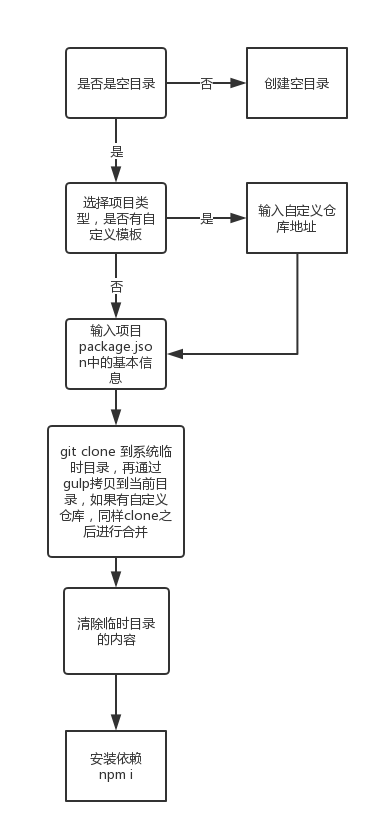

# slush-node

## 介绍

node项目脚手架工具。

没有基于Yeoman 进行开发，想要调研一个更轻量级的脚手架系统。最终采用的是[slush](https://github.com/slushjs/slush),搭配使用基于任务流的自动化构建工具[gulp](https://gulpjs.com/)。

## 依赖

* [slush](https://github.com/slushjs/slush)
* [gulp](https://gulpjs.com/)

## 功能

* 读取本地git配置文件，获取默认信息（系统信息，目录信息）
* 提供多种项目类型的模板进行选择。
* 允许自定义模板仓库的地址（github/gitlab）
* 项目package.json自定义信息

## 流程图

